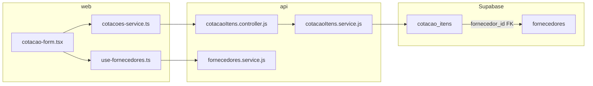

# Plano: Fornecedor por item em cotações

## Contexto

Hoje `cotacao_itens` não possui `fornecedor_id` — um POST com esse campo retorna erro do Supabase. O fornecedor só aparece em `cotacao_propostas` e `cotacoes.fornecedor_vencedor_id`, sem CRUD de propostas na API.

**Decisão confirmada:** fornecedor **obrigatório** em todo item novo ou editado.



---

## 1. Migration no banco (Supabase)

Criar arquivo de referência em [`api/migrations/20260608_add_fornecedor_id_to_cotacao_itens.sql`](api/migrations/20260608_add_fornecedor_id_to_cotacao_itens.sql):

```sql
ALTER TABLE cotacao_itens
  ADD COLUMN IF NOT EXISTS fornecedor_id uuid
  REFERENCES fornecedores(id);

CREATE INDEX IF NOT EXISTS idx_cotacao_itens_fornecedor_id
  ON cotacao_itens(fornecedor_id);
```

**Execução:** rodar manualmente no SQL Editor do Supabase (o projeto não tem runner de migrations nem `pg` no [`api/package.json`](api/package.json)).

**Itens existentes:** ficam com `fornecedor_id = NULL`. Na primeira edição, o frontend exigirá seleção de fornecedor antes de salvar.

---

## 2. Ajustes na API

### 2.1 Service — join na listagem

Arquivo: [`api/src/modules/cotacoesItem/services/cotacaoItens.service.js`](api/src/modules/cotacoesItem/services/cotacaoItens.service.js)

Alterar `listarItensCotacao` e `buscarItemPorId` para incluir join (mesmo padrão de [`cotacoes.service.js`](api/src/modules/cotacoes/services/cotacoes.service.js)):

```js
.select(`
  *,
  fornecedores:fornecedor_id (
    id,
    razao_social,
    nome_fantasia
  )
`)
```

### 2.2 Controller — validação obrigatória

Arquivo: [`api/src/modules/cotacoesItem/controllers/cotacaoItens.controller.js`](api/src/modules/cotacoesItem/controllers/cotacaoItens.controller.js)

Em `createItemCotacao` e `updateItemCotacao`:

- Exigir `fornecedor_id` no body (retorno `400` se ausente)
- Validar existência do fornecedor via `buscarFornecedorPorId` de [`fornecedores.service.js`](api/src/modules/fornecedores/services/fornecedores.service.js) (retorno `400` se inexistente/inativo)
- Inserir/atualizar apenas campos permitidos: `produto_id`, `descricao`, `quantidade`, `unidade`, `ordem`, `especificacoes`, `fornecedor_id` (evitar spread cego de `req.body`)

### 2.3 Vínculo ao excluir fornecedor

Arquivo: [`api/src/modules/fornecedores/services/fornecedores.service.js`](api/src/modules/fornecedores/services/fornecedores.service.js)

Em `verificarRelacionamentosFornecedorService`, adicionar contagem em `cotacao_itens` onde `fornecedor_id = id`, além do check atual em `cotacao_propostas`. Retornar `relacionamentos.itens` no payload para mensagens de bloqueio de exclusão.

---

## 3. Frontend — camada de dados

### 3.1 Novo service e hook de fornecedores

Criar seguindo o padrão de [`web/services/produtos-service.ts`](web/services/produtos-service.ts) e [`web/hooks/use-produtos.ts`](web/hooks/use-produtos.ts):

| Arquivo | Responsabilidade |
|---------|------------------|
| [`web/services/fornecedores-service.ts`](web/services/fornecedores-service.ts) | `GET /fornecedores`, DTO `ApiFornecedorDTO`, mapper para `Fornecedor` |
| [`web/hooks/use-fornecedores.ts`](web/hooks/use-fornecedores.ts) | `useQuery` com key `["fornecedores"]` |

Mapper sugerido para label do select: `nomeFantasia ?? razaoSocial ?? nome`.

### 3.2 Types

Arquivo: [`web/types/index.ts`](web/types/index.ts)

```typescript
export interface ItemCotacao {
  // ...campos existentes
  fornecedorId: string;
  fornecedorNome?: string;
}

export interface ItemCotacaoInput {
  // ...campos existentes
  fornecedorId: string;
}
```

### 3.3 Cotacoes service

Arquivo: [`web/services/cotacoes-service.ts`](web/services/cotacoes-service.ts)

- `ApiItemCotacaoDTO`: adicionar `fornecedor_id` e `fornecedores?: { id, razao_social, nome_fantasia }`
- `mapApiItemToItemCotacao`: mapear `fornecedorId` e `fornecedorNome`
- `mapItemToApiPayload`: incluir `fornecedor_id: item.fornecedorId`

### 3.4 Testes

Arquivo: [`web/services/cotacoes-service.test.ts`](web/services/cotacoes-service.test.ts)

- Adicionar caso que mapeia `fornecedor_id` e join `fornecedores`
- Atualizar expects existentes para incluir `fornecedorId` quando aplicável

---

## 4. Frontend — UI

### 4.1 Formulário de cotação

Arquivo: [`web/components/cotacoes/cotacao-form.tsx`](web/components/cotacoes/cotacao-form.tsx)

| Mudança | Detalhe |
|---------|---------|
| Import | `useFornecedores` |
| `ItemFormRow` | adicionar `fornecedorId?: string` |
| Estado inicial | incluir `fornecedorId` ao carregar itens existentes |
| Tabela | nova coluna **Fornecedor \*** entre Produto e Descrição |
| Select | fornecedores ativos + fornecedor já vinculado em edição (mesmo padrão de produtos) |
| `validate()` | `if (!item.fornecedorId) return "Item N: selecione um fornecedor."` |
| `handleSubmit` | enviar `fornecedorId` no payload de cada item |

### 4.2 Página de detalhe

Arquivo: [`web/app/cotacoes/[id]/page.tsx`](web/app/cotacoes/[id]/page.tsx)

- Nova coluna **Fornecedor** na tabela de itens
- Exibir `item.fornecedorNome` (fallback: "—" para itens legados ainda sem fornecedor no banco)

---

## 5. Verificação

1. Rodar migration no Supabase SQL Editor
2. Reiniciar API (`npm run start` em `api/`)
3. Testar via API:
   - `POST /cotacao-itens/cotacao/:id` sem `fornecedor_id` → `400`
   - `POST` com `fornecedor_id` válido → `201` com campo persistido
   - `GET /cotacao-itens/cotacao/:id` → retorna join `fornecedores`
4. Testar frontend (gestor):
   - Criar cotação com 2 itens, cada um com fornecedor
   - Editar e trocar fornecedor de um item
   - Detalhe exibe nome do fornecedor
5. Rodar testes: `npm test` em `web/` (vitest do mapper)

---

## Arquivos impactados (resumo)

| Camada | Criar | Modificar |
|--------|-------|-----------|
| DB | `api/migrations/20260608_add_fornecedor_id_to_cotacao_itens.sql` | — |
| API | — | `cotacaoItens.service.js`, `cotacaoItens.controller.js`, `fornecedores.service.js` |
| Web | `fornecedores-service.ts`, `use-fornecedores.ts` | `types/index.ts`, `cotacoes-service.ts`, `cotacoes-service.test.ts`, `cotacao-form.tsx`, `cotacoes/[id]/page.tsx` |

## Fora de escopo

- CRUD de `cotacao_propostas`
- `fornecedor_vencedor_id` no cabeçalho da cotação
- Migrar página `/fornecedores` de mocks para API (permanece como está; o hook novo é só para o select de itens)
